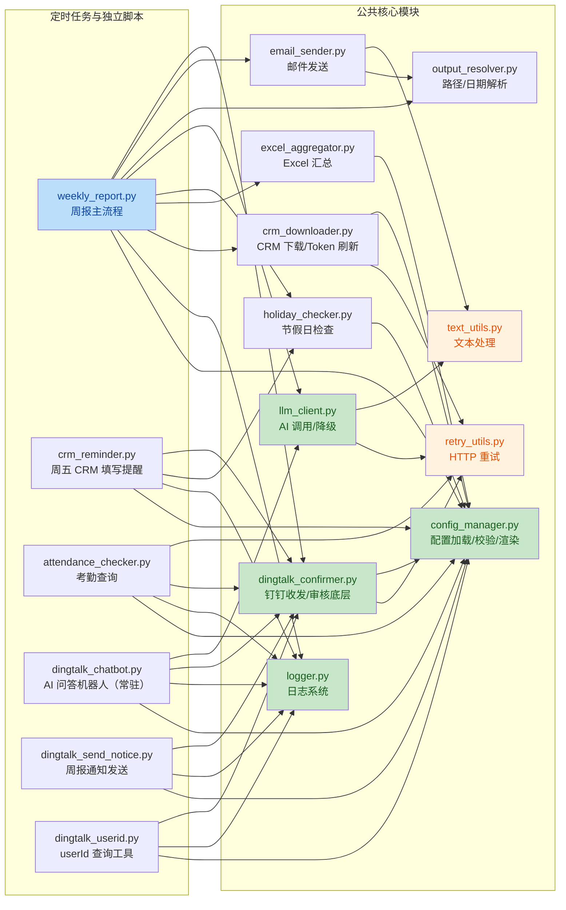
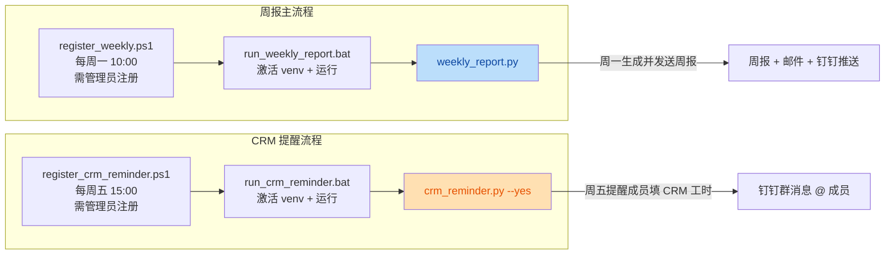
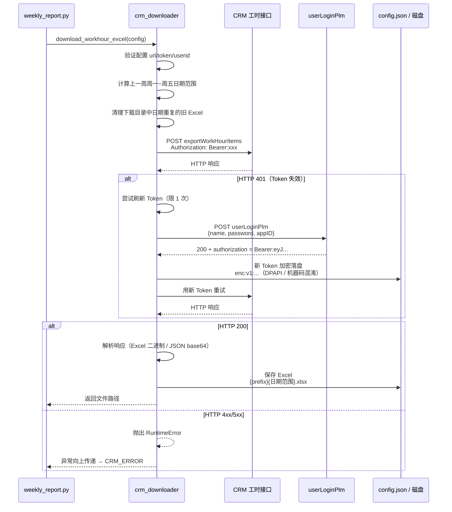
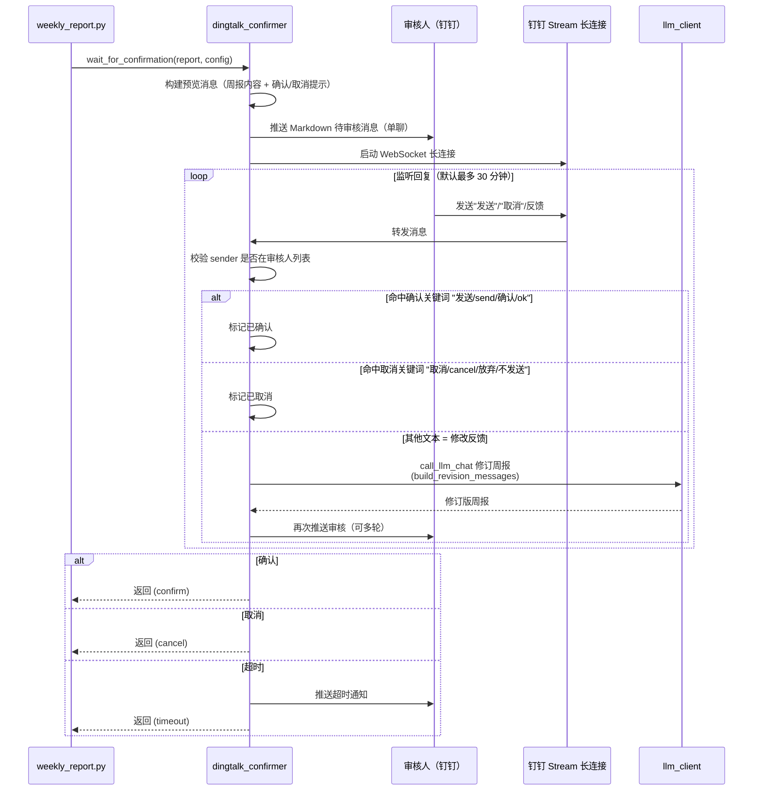
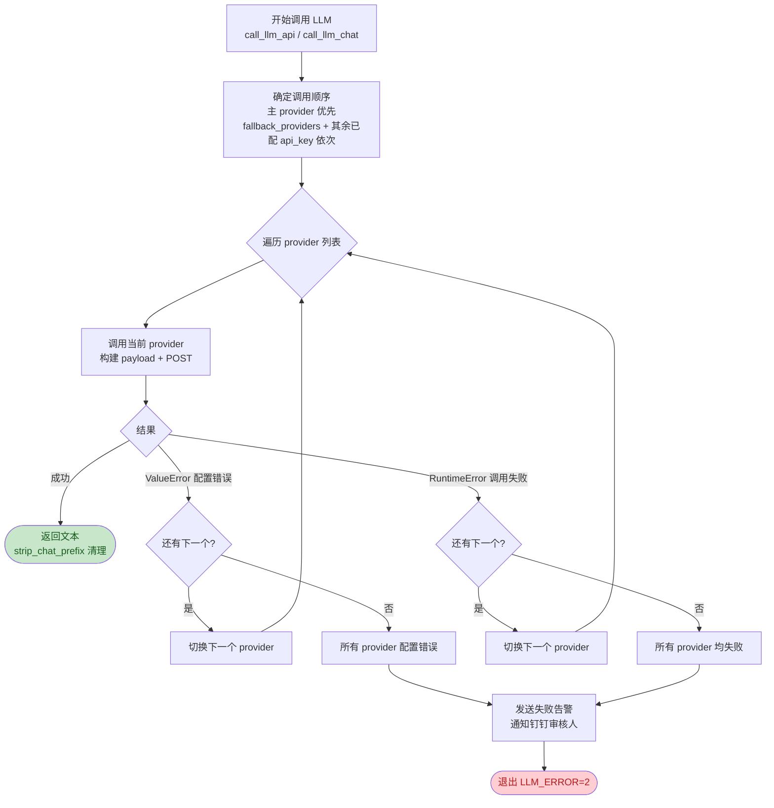
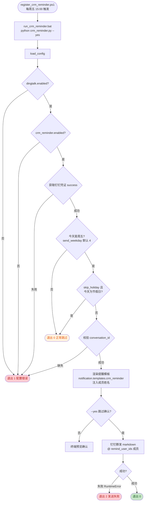
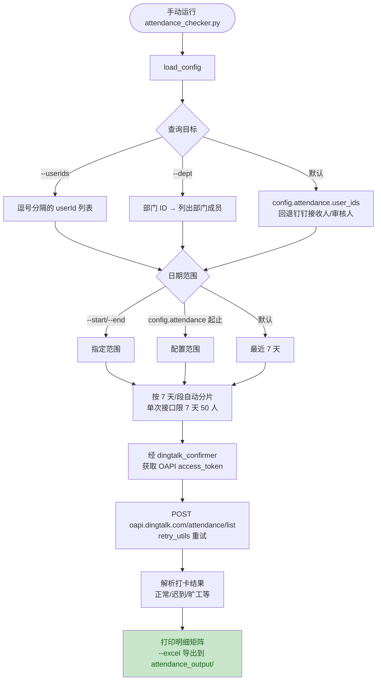
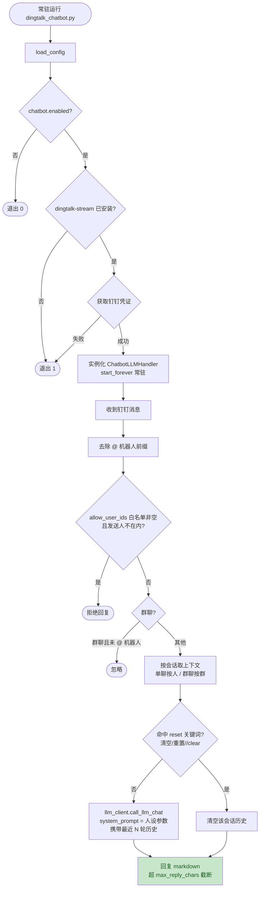

# AI 周报生成器 — 项目流程图

> 本文档用 Mermaid 描述整个项目的业务流程、模块依赖与各脚本执行路径。
> 阅读方式：GitHub / Typora / VS Code 安装 Mermaid 插件后可直接渲染。

---

## 一、整体业务流程（weekly_report.py 主流程）

```mermaid
flowchart TD
    Start([周一定时触发<br/>或手动运行]) --> Lock{获取单实例锁}
    Lock -->|已有进程运行| LockFail([退出 LOCK_FAILED=10])
    Lock -->|成功| Load[加载 config.json<br/>+ 环境变量 + .env]
    Load --> ApplyArgs[CLI 参数覆盖配置<br/>--provider/--model/--format/--folder 等]
    ApplyArgs --> Validate[启动关键配置校验<br/>AI api_key / CRM / 邮箱 / 钉钉凭证]
    Validate -->|缺失| CfgError([退出 CONFIG_ERROR=11])
    Validate -->|通过| InitLog[初始化日志<br/>logs/{周报名}.txt<br/>清理 90 天前旧日志]

    InitLog --> Force{--force?}
    Force -->|是| SkipHoliday[跳过节假日检查]
    Force -->|否| CheckHoliday[节假日检查<br/>硬编码 > timor.tech API > 缓存 > 周末规则]
    CheckHoliday --> IsHoliday{今天是节假日/周末?}
    IsHoliday -->|是| SkipExec([正常退出 SUCCESS=0<br/>不生成周报])
    IsHoliday -->|否| SkipHoliday

    SkipHoliday --> CrmOn{CRM 启用<br/>且未 --no-crm?}
    CrmOn -->|是| DownloadCrm[下载 CRM 工时 Excel<br/>计算上一周周一~周五<br/>清理日期重复旧文件]
    CrmOn -->|否| UseLocal[取 excel_folder 下<br/>最新修改的本地 Excel]

    DownloadCrm --> CrmOk{下载成功?}
    CrmOk -->|失败| CrmFail[发送失败告警<br/>通知钉钉审核人]
    CrmFail --> ExitCrm([退出 CRM_ERROR=1])
    CrmOk -->|成功| Aggregate[Excel 汇总<br/>提取 B/D/H 三列 + F/G/I 时间工时<br/>单文件内去重]
    UseLocal --> Aggregate

    Aggregate --> DryRun{--dry-run?}
    DryRun -->|是| Print[打印汇总结果]
    Print --> ExitDry([正常退出 SUCCESS=0])
    DryRun -->|否| BuildPrompt[构建 AI Prompt<br/>格式模板 + 汇总文本]

    BuildPrompt --> CallLLM[调用 LLM API<br/>provider 失败自动降级<br/>--thinking 可选]
    CallLLM --> LLMOk{生成成功?}
    LLMOk -->|失败| LLMFail[发送失败告警]
    LLMFail --> ExitLLM([退出 LLM_ERROR=2])
    LLMOk -->|成功| Save[保存周报<br/>reports/Vue{last_week_range}周报.md]

    Save --> DtNeed{钉钉启用<br/>且未 --no-confirm?}
    DtNeed -->|需审核| Review[推送预览给审核人<br/>Stream 长连接等待回复]
    DtNeed -->|免审| DirectDt[直接推送钉钉给接收人]

    Review --> ReviewRs{审核结果}
    ReviewRs -->|确认"发送"| DirectDt
    ReviewRs -->|取消"取消/放弃"| ExitOk1([正常退出 SUCCESS=0<br/>周报文件保留，不发送])
    ReviewRs -->|反馈问题| Regen[重新调 LLM 修订周报<br/>再次推送审核（可多轮）]
    Regen --> Review
    ReviewRs -->|30 分钟超时| Timeout1([超时自动放弃])
    Review -->|流程异常| DtErr[发送失败告警]
    DtErr --> ExitDt([退出 DINGTALK_ERROR=4])

    DirectDt --> MailOn{邮件启用<br/>且未 --no-email?}
    MailOn -->|是| SendMail[发送邮件<br/>正文: Markdown 转 HTML<br/>附件: 周报.md + CRM Excel]
    MailOn -->|否| Done([完成 SUCCESS=0])
    SendMail --> MailOk{发送成功?}
    MailOk -->|失败| MailFail[发送失败告警]
    MailFail --> ExitMail([退出 EMAIL_ERROR=3])
    MailOk -->|成功| Done

    style Start fill:#bbdefb,color:#0d47a1
    style Done fill:#c8e6c9,color:#1a5e20
    style SkipExec fill:#fff3e0,color:#e65100
    style ExitDry fill:#fff3e0,color:#e65100
    style ExitOk1 fill:#fff3e0,color:#e65100
    style Timeout1 fill:#fff3e0,color:#e65100
    style LockFail fill:#ffcdd2,color:#b71c1c
    style CfgError fill:#ffcdd2,color:#b71c1c
    style ExitCrm fill:#ffcdd2,color:#b71c1c
    style ExitLLM fill:#ffcdd2,color:#b71c1c
    style ExitEmail fill:#ffcdd2,color:#b71c1c
    style ExitDt fill:#ffcdd2,color:#b71c1c
```

---

## 二、模块全景依赖关系



---

## 三、定时任务链



---

## 四、CRM 下载详细流程（含 Token 自动刷新）



---

## 五、钉钉人工审核流程



---

## 六、AI Provider 降级调用流程



> 内置 provider：`minimax` / `deepseek` / `opencode` / `qwen` / `volc_glm`（火山方舟 GLM-5.3）
> 以及 `opencode_deepseek`，均可通过 `--provider` 切换，配置见 `config.json` 的 `providers` 段。

---

## 七、CRM 提醒脚本（crm_reminder.py）



---

## 八、考勤检查脚本（attendance_checker.py）



---

## 九、钉钉 AI 问答机器人（dingtalk_chatbot.py）



---

## 十、退出码定义

| 退出码 | 含义 | 触发场景 |
|--------|------|----------|
| 0 | 成功 | 周报生成并发送完成、节假日跳过、`--dry-run`、审核未确认取消等正常退出 |
| 1 | CRM / 配置错误 | CRM 下载失败、Excel 文件缺失、独立脚本（提醒/通知）配置缺失 |
| 2 | LLM 错误 | 所有 AI Provider 均失败；通知/提醒脚本发送失败 |
| 3 | 邮件错误 | SMTP 发送失败 |
| 4 | 钉钉错误 | 钉钉审核流程异常、推送失败 |
| 10 | 锁失败 | 已有周报进程运行，拒绝重复启动 |
| 11 | 配置校验失败 | 启动时关键配置缺失（`validate_required_config` 抛错） |

---

## 十一、关键文件职责

| 文件 | 职责 |
|------|------|
| [weekly_report.py](../weekly_report.py) | 主入口，编排全流程（下载 → 汇总 → AI → 审核 → 发送） |
| [config_manager.py](../config_manager.py) | 配置加载/默认值合并/环境变量覆盖/启动校验/通知模板渲染 |
| [crm_downloader.py](../crm_downloader.py) | CRM 工时 Excel 下载、日期范围计算、Token 自动刷新与加密落盘 |
| [excel_aggregator.py](../excel_aggregator.py) | 单文件列识别（B/D/H）+ 去重汇总 |
| [llm_client.py](../llm_client.py) | OpenAI 兼容 AI 调用、prompt 构建、provider 降级、token 统计 |
| [dingtalk_confirmer.py](../dingtalk_confirmer.py) | 钉钉消息唯一发送实现：审核流、Stream 监听、单聊/群聊推送、凭证与 OAPI token |
| [email_sender.py](../email_sender.py) | 腾讯企业邮箱 SMTP 发送（Markdown 转 HTML + 附件） |
| [holiday_checker.py](../holiday_checker.py) | 节假日判断（硬编码 > timor.tech API > 缓存 > 周末规则） |
| [output_resolver.py](../output_resolver.py) | 输出路径解析、上一周日期范围、模板占位符 |
| [logger.py](../logger.py) | 控制台 + 日志文件双写，按周报名称落盘，自动清理旧日志 |
| [retry_utils.py](../retry_utils.py) | 通用 HTTP 指数退避重试 |
| [text_utils.py](../text_utils.py) | 对话前缀清理、Markdown 转 HTML |
| [crm_reminder.py](../crm_reminder.py) | 每周五 CRM 工时填写提醒（独立定时任务） |
| [attendance_checker.py](../attendance_checker.py) | 钉钉考勤记录查询与导出 |
| [dingtalk_chatbot.py](../dingtalk_chatbot.py) | AI 问答机器人（常驻 Stream 进程） |
| [dingtalk_send_notice.py](../dingtalk_send_notice.py) | 群发周报"已生成"通知（单聊） |
| [dingtalk_userid.py](../dingtalk_userid.py) | 查询部门/手机号 userId、群 conversationId 工具 |
| [register_weekly.ps1](../register_weekly.ps1) / [register_crm_reminder.ps1](../register_crm_reminder.ps1) | 注册 Windows 计划任务（周一 10:00 / 周五 15:00） |
| [run_weekly_report.bat](../run_weekly_report.bat) / [run_crm_reminder.bat](../run_crm_reminder.bat) | 定时任务启动脚本（激活 venv + 运行 + 记日志 + 透传退出码） |