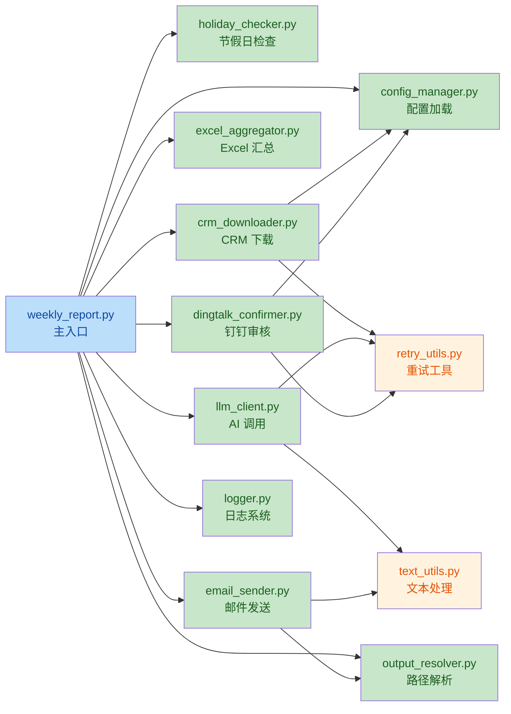
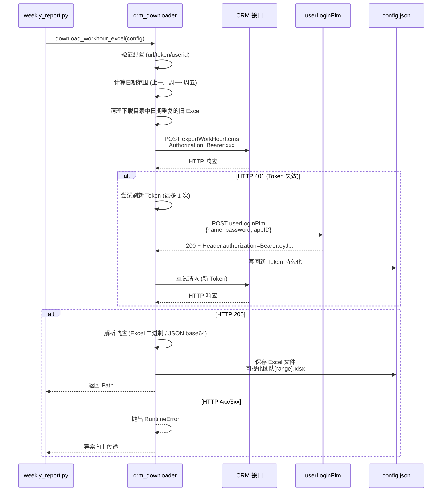
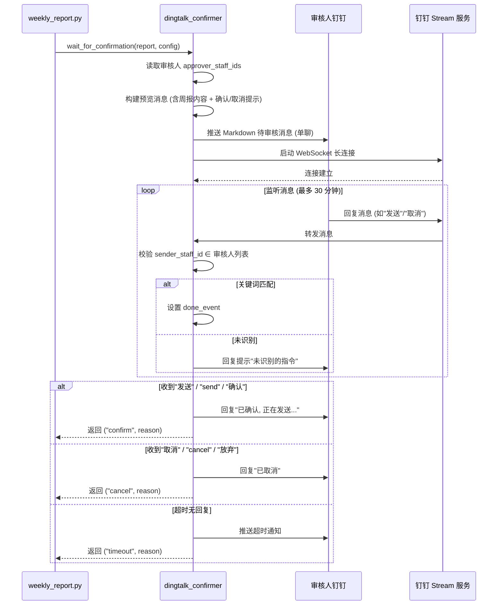
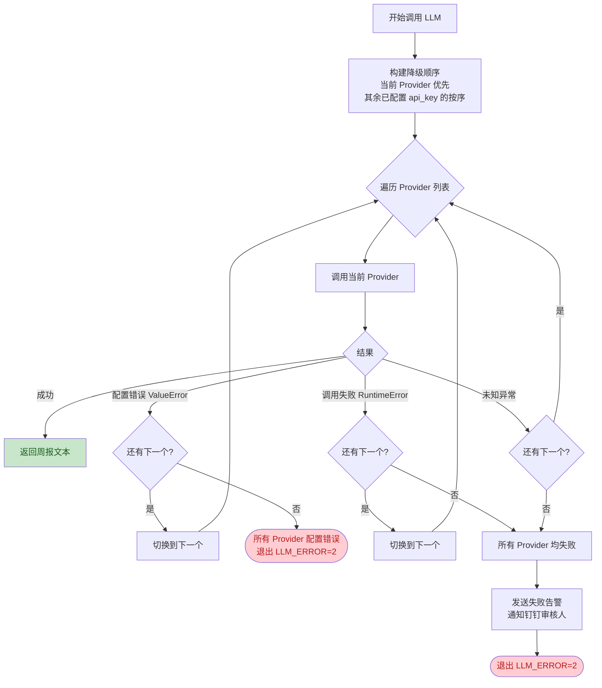

# AI 周报生成器 - 项目流程图

## 一、整体业务流程

```mermaid
flowchart TD
    Start([周一 10:00 定时触发<br/>或手动运行]) --> Lock{获取单实例锁}
    Lock -->|失败<br/>已有进程运行| LockFail([退出 LOCK_FAILED=10])
    Lock -->|成功| Load[加载 config.json<br/>+ 环境变量 + .env]

    Load --> ApplyArgs[应用 CLI 参数覆盖配置<br/>--provider / --output / --folder 等]
    ApplyArgs --> InitLog[初始化日志系统<br/>logs/{周报名}.txt<br/>自动清理 90 天前旧日志]

    InitLog --> Holiday{--force?}
    Holiday -->|是| SkipHoliday[跳过节假日检查]
    Holiday -->|否| CheckHoliday[节假日检查<br/>硬编码规则 > timor.tech API > 缓存 > 周末规则]
    CheckHoliday --> IsHoliday{今天是节假日?}
    IsHoliday -->|是| SkipExec([跳过执行 SUCCESS=0])
    IsHoliday -->|否| SkipHoliday

    SkipHoliday --> CrmCheck{CRM 启用?<br/>--no-crm?}
    CrmCheck -->|启用且未跳过| DownloadCrm[下载 CRM 工时 Excel<br/>自动计算上一周周一至周五]
    CrmCheck -->|禁用或 --no-crm| UseLocal[使用 excel_folder 下<br/>最新修改的本地 Excel]

    DownloadCrm --> CrmOK{下载成功?}
    CrmOK -->|失败| CrmFail[发送失败告警<br/>通知钉钉审核人]
    CrmFail --> ExitCrm([退出 CRM_ERROR=1])
    CrmOK -->|成功| Aggregate

    UseLocal --> Aggregate[Excel 汇总<br/>提取 B/D/H 三列<br/>单文件内去重]
    Aggregate --> DryRun{--dry-run?}
    DryRun -->|是| PrintPreview[打印预览退出]
    PrintPreview --> ExitDry([退出 SUCCESS=0])
    DryRun -->|否| BuildPrompt[构建 AI Prompt]

    BuildPrompt --> CallLLM[调用 LLM API<br/>主 Provider 失败自动降级]
    CallLLM --> LLMOK{生成成功?}
    LLMOK -->|失败| LLMFail[发送失败告警<br/>通知钉钉审核人]
    LLMFail --> ExitLLM([退出 LLM_ERROR=2])
    LLMOK -->|成功| SaveReport[保存周报到文件<br/>reports/Vue{last_week_range}周报.md]

    SaveReport --> DtCheck{钉钉启用?<br/>--no-confirm?}
    DtCheck -->|需审核| WaitForConfirm[钉钉推送预览给审核人<br/>Stream 长连接等待回复]
    DtCheck -->|无需审核| SendDt[直接推送钉钉]

    WaitForConfirm --> ConfirmResult{审核结果}
    ConfirmResult -->|确认| SendDt
    ConfirmResult -->|取消| ExitCancel([跳过发送 SUCCESS=0])
    ConfirmResult -->|超时| ExitTimeout([超时退出])
    WaitForConfirm -->|异常| DtFail[发送失败告警]
    DtFail --> ExitDt([退出 DINGTALK_ERROR=4])

    SendDt --> SendEmail{邮件启用?<br/>--no-email?}
    SendEmail -->|启用且未跳过| SendMail[通过腾讯企业邮箱发送<br/>附件: 周报.md + CRM Excel]
    SendEmail -->|禁用或 --no-email| Done
    SendMail --> MailOK{发送成功?}
    MailOK -->|失败| MailFail[发送失败告警]
    MailFail --> ExitMail([退出 EMAIL_ERROR=3])
    MailOK -->|成功| Done([完成 SUCCESS=0])

    style Start fill:#bbdefb,color:#0d47a1
    style Done fill:#c8e6c9,color:#1a5e20
    style ExitCrm fill:#ffcdd2,color:#b71c1c
    style ExitLLM fill:#ffcdd2,color:#b71c1c
    style ExitMail fill:#ffcdd2,color:#b71c1c
    style ExitDt fill:#ffcdd2,color:#b71c1c
    style ExitCancel fill:#fff3e0,color:#e65100
    style ExitTimeout fill:#fff3e0,color:#e65100
    style ExitDry fill:#fff3e0,color:#e65100
    style SkipExec fill:#fff3e0,color:#e65100
    style LockFail fill:#ffcdd2,color:#b71c1c
```

## 二、模块依赖关系



## 三、CRM 下载详细流程（含 Token 自动刷新）



## 四、钉钉人工审核详细流程



## 五、AI Provider 降级调用流程



## 六、关键文件与职责

| 文件 | 职责 |
|------|------|
| [weekly_report.py](file:///c:/Users/w/Desktop/InteVueWeb/AIWeeklyReportMaster/weekly_report.py) | 主入口，编排全流程 |
| [config_manager.py](file:///c:/Users/w/Desktop/InteVueWeb/AIWeeklyReportMaster/config_manager.py) | 加载配置、默认值合并、环境变量覆盖、通知模板渲染 |
| [holiday_checker.py](file:///c:/Users/w/Desktop/InteVueWeb/AIWeeklyReportMaster/holiday_checker.py) | 节假日检查（硬编码 > 在线 API > 缓存 > 周末规则） |
| [crm_downloader.py](file:///c:/Users/w/Desktop/InteVueWeb/AIWeeklyReportMaster/crm_downloader.py) | CRM 工时 Excel 下载、Token 自动刷新 |
| [excel_aggregator.py](file:///c:/Users/w/Desktop/InteVueWeb/AIWeeklyReportMaster/excel_aggregator.py) | 提取 B/D/H 三列、单文件内去重 |
| [llm_client.py](file:///c:/Users/w/Desktop/InteVueWeb/AIWeeklyReportMaster/llm_client.py) | LLM API 调用、OpenAI 兼容协议 |
| [dingtalk_confirmer.py](file:///c:/Users/w/Desktop/InteVueWeb/AIWeeklyReportMaster/dingtalk_confirmer.py) | 钉钉审核流程、Stream 长连接、失败告警 |
| [email_sender.py](file:///c:/Users/w/Desktop/InteVueWeb/AIWeeklyReportMaster/email_sender.py) | 腾讯企业邮箱 SMTP 发送 |
| [output_resolver.py](file:///c:/Users/w/Desktop/InteVueWeb/AIWeeklyReportMaster/output_resolver.py) | 输出路径解析、日期占位符替换 |
| [logger.py](file:///c:/Users/w/Desktop/InteVueWeb/AIWeeklyReportMaster/logger.py) | 日志系统（tee stdout/stderr 到文件） |
| [retry_utils.py](file:///c:/Users/w/Desktop/InteVueWeb/AIWeeklyReportMaster/retry_utils.py) | 通用 HTTP 重试工具（指数退避） |
| [text_utils.py](file:///c:/Users/w/Desktop/InteVueWeb/AIWeeklyReportMaster/text_utils.py) | 文本清洗、Markdown 转 HTML |
| [dingtalk_userid.py](file:///c:/Users/w/Desktop/InteVueWeb/AIWeeklyReportMaster/dingtalk_userid.py) | 钉钉 userId 查询工具 |
| [dingtalk_send_notice.py](file:///c:/Users/w/Desktop/InteVueWeb/AIWeeklyReportMaster/dingtalk_send_notice.py) | 钉钉通知发送工具 |
| [diagnose_email.py](file:///c:/Users/w/Desktop/InteVueWeb/AIWeeklyReportMaster/diagnose_email.py) | 邮箱 SMTP 诊断工具 |

## 七、退出码定义

| 退出码 | 含义 | 触发场景 |
|--------|------|---------|
| 0 | 成功 | 周报生成并发送完成，或节假日跳过、dry-run、用户取消等正常退出 |
| 1 | CRM 错误 | CRM 下载失败、Excel 文件夹不存在 |
| 2 | LLM 错误 | 所有 AI Provider 均失败 |
| 3 | 邮件错误 | SMTP 发送失败 |
| 4 | 钉钉错误 | 钉钉审核流程异常、发送失败 |
| 10 | 锁失败 | 已有进程运行，拒绝启动 |

## 八、关键设计决策

1. **单文件处理**：不再扫描目录、不做跨文件合并，只处理 CRM 下载的或最新的单个 Excel 文件
2. **列字母优先**：提取 B/D/H 列时优先按表头名匹配，失败时回退到列字母，保证 CRM 与手工 Excel 都能处理
3. **Token 自动刷新**：CRM JWT 失效时自动调用登录接口刷新，持久化到 config.json
4. **Provider 降级**：当前 Provider 失败时自动切换到其他已配置 api_key 的 Provider
5. **Stream 自实现监听**：避免 SDK 的 `start()` 无限重连问题，支持 `done_event` 优雅退出
6. **日志 tee 机制**：通过包装 stdout/stderr，所有 print 输出同步写入日志文件
7. **节假日三级兜底**：硬编码规则 > 在线 API > 缓存 > 周末规则
8. **通知模板系统**：支持多通知类型，自动注入联系方式占位符
